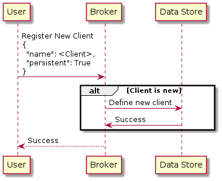
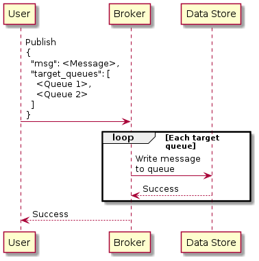
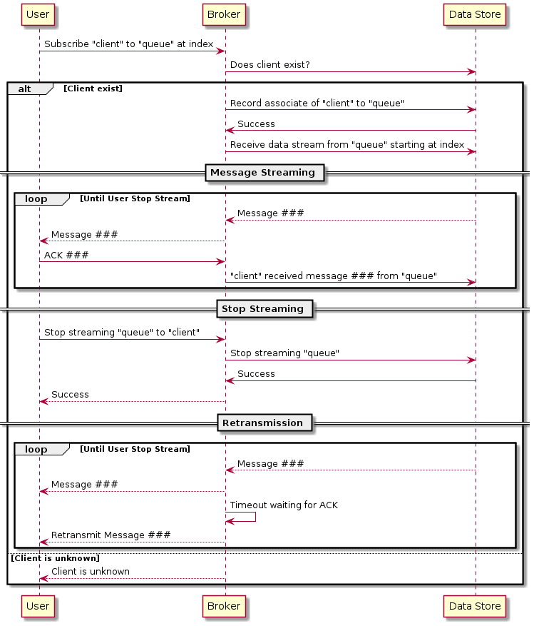

# Broker Layer

The broker layer is the primary interface between a client (publisher / subscriber), and the system. Through the broker layer, messages are enqueued and dequeued.

---
## Basic Operations

The broker layer supports the following user interactions.

* Manage available queues
* Client registration
  * Persistent / Transient
* Publish message to queue
* Subscribe to queues for queues
  * Supports reliable delivery
  * Supports some message persistence

---
## Queue Management

As a message broker, all communication is performed via queues. Each queue is identified by an ASCII string name, and described by a data model like

```yaml
---
name: data-queue-name
defined_at: 2021-08-02T22:30:30-07:00
indexes:
  newest: 514
  oldest: 1
```

| Field | Description | Notes |
|-------|-------------|-------|
| `name` | Message queue name | |
| `defined_at` | When the queue was first defined | |
| `indexes` | Information regarding the indexes on the queue | |
| `indexes.newest` | Newest message index on this queue | |
| `indexes.oldest` | Oldest message index on this queue | |

Message queues are not directly created. Instead, queues are defined via interactions with the queue (i.e. publish and subscribe to queues); a first interaction with a queue will also define the queue entity.

---
## Client Registration

A client to the broker is an entity which can communicate with the broker (i.e. publish and subscribe to message queues). It is describe by a data model like

```yaml
---
name: client-name
persistent: True
defined_at: 2021-08-02T22:30:30-07:00
subscribed_to:
  - name: data-queue-1
    acked_index: 514
  - name: data-queue-2
    acked_index: 193
```

| Field | Description | Notes |
|-------|-------------|-------|
| `name` | Client name | |
| `persistent` | Whether the client is persistent or not | |
| `defined_at` | When the client was first defined | |
| `subscribed_to` | Information on the queues the client is subscribed to | |
| `subscribed_to.[].name` | Queue name | |
| `subscribed_to.[].acked_index` | Index of latest message the client acknowledged receiving. | |

### Registering Clients

One would register a client with the following parameters

* `name`
* `persistent`

This would define a client entry.



### Persistent vs Transient Clients

The main feature of persistence is whether information regarding a client is retain after data retention enforcement.

For non-persistent clients, information regarding it will be deleted during retention enforcement if it has existed for longer then the retention period for a non-persistent client. This of-course does not apply to a persistent client.

---
## Publish Message On Queue

Message publish occurs on a per client bases, and support publishing to multiple queues at once.



> NOTE: Generally writing one message to multiple queues is not efficient, but the option is available.

---
## Subscribe For Message On Queue

A client can subscribe to multiple message queues via the broker.


