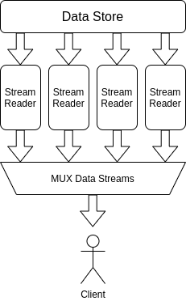

# Broker Layer

The broker layer is the primary interface between a client (publisher / subscriber), and the system. Through the broker layer, messages are enqueued and dequeued.

---
## Basic Operations

The broker layer supports the following user interactions.

* Manage available queues
* Client registration
  * Persistent / Transient
* Publish message to queue
* Subscribe to queues for queues
  * Supports reliable delivery
  * Supports some message persistence

---
## Queue Management

As a message broker, all communication is performed via queues. Each queue is identified by an ASCII string name, and described by a data model like

```yaml
---
name: data-queue-name
defined_at: 2021-08-02T22:30:30-07:00
indexes:
  newest: 514
  oldest: 1
```

| Field | Description | Notes |
|-------|-------------|-------|
| `name` | Message queue name | |
| `defined_at` | When the queue was first defined | |
| `indexes` | Information regarding the indexes on the queue | |
| `indexes.newest` | Newest message index on this queue | |
| `indexes.oldest` | Oldest message index on this queue | |

Message queues are not directly created. Instead, queues are defined via interactions with the queue (i.e. publish and subscribe to queues); a first interaction with a queue will also define the queue entity.

---
## Client Registration

A client to the broker is an entity which can communicate with the broker (i.e. publish and subscribe to message queues). It is describe by a data model like

```yaml
---
name: client-name
persistent: True
defined_at: 2021-08-02T22:30:30-07:00
subscribed_to:
  - name: data-queue-1
    acked_index: 514
    outstanding_index:
      - 510
      - 512
  - name: data-queue-2
    acked_index: 193
    outstanding_index:
      - 192
```

| Field | Description | Notes |
|-------|-------------|-------|
| `name` | Client name | |
| `persistent` | Whether the client is persistent or not | |
| `defined_at` | When the client was first defined | |
| `subscribed_to` | Information on the queues the client is subscribed to | |
| `subscribed_to.[].name` | Queue name | |
| `subscribed_to.[].acked_index` | Index of latest message the client acknowledged receiving. | |
| `subscribed_to.[].outstanding_index` | Index of messages still awaiting acknowledgement. | |

### Registering Clients

One would register a client with the following parameters

* `name`
* `persistent`

This would define a client entry.


### Persistent vs Transient Clients

The main feature of persistence is whether information regarding a client is retain after data retention enforcement.

For non-persistent clients, information regarding it will be deleted during retention enforcement if it has existed for longer then the retention period for a non-persistent client. This of-course does not apply to a persistent client.

---
## Publish Message On Queue

Message publish occurs on a per client bases, and support publishing to multiple queues at once.


> NOTE: Generally writing one message to multiple queues is not efficient, but the option is available.

---
## Subscribe For Message On Queue

A client can subscribe to multiple message queues via the broker.


---
## Message Delivery And Tracking



When a client subscribes for data on queues, the server starts a set of data stream reader (one for each queue the client is subscribed to). Output of the various stream readers are multiplexed over a single transport to be delivered to the client.

The data stream reader is

* Pulling messages from the data store for delivery.
* Tracking the set of messages which has not been acknowledged by the client.

The reader is configured to allow a certain number of in-flight messages (message awaiting ACK). Once that limit is reached, the reader is wait for ACKs from the client.

Since a client subscribing for messages could connect with any one of the nodes in the broker cluster, a client is not allowed to establish two subscription sessions at the same time to maintain consistency; a client connecting to multiple nodes would create data errors in the tracking for that client, as locking is not used. This is enforced through a global data structure

```yaml
---
active_clients_subs:
  client-name:
    session:
      node: serving-cluster-node
      connected_at: 2021-08-02T22:30:30-07:00
  client-name-2:
    session:
      node: serving-cluster-node
      connected_at: 2021-08-02T22:30:30-07:00
```

Before a node accepts to serve the subscription request of a client, it must first verify that client does not have any active sessions.
